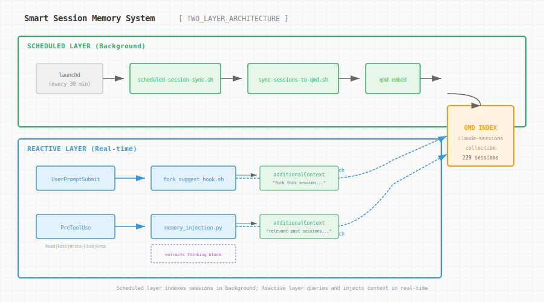
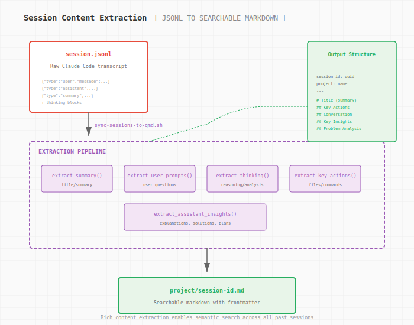

# Teaching Claude to Remember: Building a Session Memory System

Every time I start a new Claude Code session, it's like meeting someone with amnesia. We've solved this exact problem before. We've debugged this same timeout issue. We've wrestled with this API integration. But Claude doesn't know that. Each session starts fresh, context-free, tabula rasa.

That started to bother me.

## The Problem With Ephemeral Sessions

Claude Code stores everything. Every session lives as a JSONL file in `~/.claude/projects/`, complete with user prompts, assistant responses, thinking blocks, tool uses, and summaries. Hundreds of sessions. Thousands of conversations. A goldmine of institutional knowledge.

But it just sits there. Unused. Unsearchable.

```
~/.claude/projects/
├── -Users-somto-code-altschool-web-platforms/
│   ├── a107300d-72a3-466d-bacd-1e0d8dd33c16.jsonl
│   ├── sessions-index.json
│   └── ...
├── -Users-somto-code-somto-dev-toolkit/
│   └── ...
```

I'd find myself explaining the same architectural decisions, re-discovering the same gotchas, re-solving the same problems. The sessions were there. The knowledge was there. But there was no bridge between past and present.

What if Claude could remember?

## The Vision: Two-Layer Memory

I wanted something that felt natural. Not a manual "search your history" command—that's just grep with extra steps. I wanted Claude to automatically surface relevant context when it mattered.

The architecture that emerged has two layers:



**Scheduled Layer (Background)**: Every 30 minutes, a launchd job (or cron on Linux) syncs sessions to searchable markdown files. These get indexed by [qmd](https://github.com/tobi/qmd), a tool designed for exactly this kind of document search.

**Reactive Layer (Real-time)**: Two hooks that fire during normal Claude Code operation:
- `UserPromptSubmit` — When you start typing, check if this looks like something we've done before. If so, suggest forking that session.
- `PreToolUse` — Before Claude reads a file or runs a search, inject relevant context from past sessions.

The key insight: use Claude's own thinking blocks as the query. When Claude is reasoning about "fixing a timeout issue with the course tree API," that reasoning becomes a search query against all past sessions. If we've solved something similar, surface it.

## The Implementation Journey

### Starting With the Plan

The plan looked clean on paper. Extract thinking, query qmd, inject context. Simple, right?

```
PreToolUse ──→ memory_injection.py
     │             └─ Extract thinking block from transcript
     │             └─ Hash dedup (skip if same query)
     │             └─ Query qmd (vsearch, 5s timeout)
     │             └─ Inject via additionalContext
     ↓
Tool executes with relevant context from past sessions
```

Then reality intervened.

### Correction #1: vsearch vs search

The plan called for `qmd vsearch`—semantic vector search. Sounds perfect for finding conceptually similar sessions.

One problem: vsearch needs to load an embedding model. First call takes ~60 seconds. Not acceptable for a hook that fires before every file read.

The fix: use `qmd search` instead. BM25 keyword search. Instant. Good enough for our needs—we're matching against thinking blocks, which already contain the relevant terminology.

```python
# Uses 'search' (BM25 keyword) instead of 'vsearch' (semantic) because:
# - search is instant, vsearch needs ~1 min model load on first use
# - Real-time hooks need <5s response time
```

### Correction #2: The SIGPIPE Problem

I was extracting content with bash pipelines:

```bash
jq '...' "$jsonl_file" | head -20
```

Clean. Readable. Broken.

With `set -euo pipefail`, when `head` gets its 20 lines and closes the pipe, `jq` receives SIGPIPE and exits with code 141. Pipeline fails. Script fails.

The fix: replace `head` with `awk`:

```bash
jq '...' "$jsonl_file" | awk 'NR<=20'
```

`awk` reads everything but only prints the first 20 lines. No SIGPIPE. No failure.

### Correction #3: qmd's JSON Field Names

The fork suggestion hook parses qmd's JSON output:

```bash
SESSION_PATH=$(echo "$RESULTS" | jq -r '.[0].path // ""')
```

Empty string. Every time.

Turns out qmd uses `file`, not `path`:

```bash
SESSION_PATH=$(echo "$RESULTS" | jq -r '.[0].file // ""')
```

Small things. Easy to miss. These are the corrections that only surface when you actually run the code.

## What Gets Extracted

Here's where it gets interesting. The raw JSONL contains everything—but most of it is noise. Tool results, system reminders, skill content. We need the signal.



The extraction pipeline pulls:

1. **Summary** — Used as the title when available (better than "create the pr for me")
2. **User prompts** — The actual questions being asked
3. **Thinking blocks** — Problem analysis, reasoning, plans
4. **Assistant insights** — Explanations, solutions, the "aha" moments
5. **Key actions** — Files read/edited, commands run

A session that started as sparse metadata:

```markdown
# create the pr for me
## Session Summary
Course tree timeout increased to 120s, added staleTime
```

Becomes a rich, searchable document:

```markdown
# Course tree timeout increased to 120s, added staleTime

**Initial request:** create the pr for me

## Key Actions
- Read: apps/student/src/lib/hooks/student-center/use-nano-diploma-course.ts
- Edit: apps/student/src/lib/hooks/student-center/use-nano-diploma-course.ts
- Ran: bun run check-types --filter=student

## Conversation Highlights
can you use ast-grep to find out where this endpoint is used...
my backend is saying: The endpoints works, i think the web app has a timeout setting that's too small...
are we confident in the fix?

## Problem Analysis
The user's backend team is saying the endpoint works but the web app has a timeout that's too small. I need to:
1. Check the fetcher configuration for timeout settings
2. Check if there's a timeout on the useQuery hook
3. Look at the ky configuration...

By default, ky has a timeout of 10 seconds (10000ms). This is likely why the expensive `/course/{courseId}/tree` endpoint is timing out.
```

Now when I search for "ky timeout default 10 seconds," I find this session. The problem analysis is searchable. The reasoning is preserved.

## The Hook System

Claude Code plugins can define hooks that fire at specific points:

```json
{
  "hooks": {
    "PreToolUse": [
      {
        "matcher": "Read|Edit|Write|Glob|Grep",
        "hooks": [{
          "command": "python3 ${CLAUDE_PLUGIN_ROOT}/hooks/memory_injection.py",
          "timeout": 10
        }]
      }
    ],
    "UserPromptSubmit": [
      {
        "hooks": [{
          "command": "${CLAUDE_PLUGIN_ROOT}/hooks/fork_suggest_hook.sh",
          "timeout": 8
        }]
      }
    ]
  }
}
```

The memory injection hook only fires for "thinking" tools—Read, Edit, Write, Glob, Grep. These are the moments when context matters. When Claude is about to read a file, knowing we've worked with similar files before is useful. When it's about to search, knowing what we found last time is useful.

The fork suggestion fires once, at session start. If your first prompt looks like something you've done before, you get:

```
🔍 SIMILAR PAST SESSION FOUND:

"Course tree timeout increased to 120s, added staleTime"

To fork and continue from this session, run in a NEW terminal:

  claude --resume a107300d-72a3-466d-bacd-1e0d8dd33c16 --fork-session
```

You can pick up where you left off.

## The Deduplication Problem

Without deduplication, you'd see the same "relevant sessions" injected before every single tool use. Annoying and wasteful.

Two levels of dedup:

1. **Hash-based**: MD5 hash of the current thinking block. If it matches the last query, skip. Stored in `/tmp/{session_id}_memory_hash`.

2. **Session-based**: Track which document IDs we've already shown. Don't repeat yourself. Stored in `/tmp/{session_id}_shown_memories`.

Both use temp files that naturally clean up when the session ends.

## Cross-Platform Considerations

The scheduled sync needs a scheduler. macOS has launchd. Linux has cron. WSL technically has cron but needs you to start the service manually.

```bash
if [[ "$OSTYPE" == "darwin"* ]]; then
    # macOS: use launchd
    # Write plist, launchctl load
else
    # Linux: use cron
    # */30 * * * * ...
fi
```

PATH is another gotcha. launchd jobs don't inherit your shell's PATH. qmd might be in `~/.cargo/bin` or `~/.local/bin` or `/opt/homebrew/bin`. The setup script explicitly includes common locations:

```bash
path_value="$HOME/.local/bin:$HOME/.cargo/bin:/opt/homebrew/bin:/usr/local/bin:/usr/bin:/bin"
```

## What This Enables

After setup, 229 sessions become searchable. 492 document chunks get embedded. And Claude starts to remember.

Search for a concept:
```bash
qmd search "fix timeout issue API endpoint" -c claude-sessions
```

Get back:
```
Title: Course tree timeout increased to 120s, added staleTime
Score: 100%

...my backend is saying: The endpoints works, i think the web app
has a timeout setting that's too small for this request...
```

The fork suggestion actually works:
```bash
echo '{"prompt":"fix timeout issue with API endpoint"}' | ./hooks/fork_suggest_hook.sh
```

```json
{
  "additionalContext": "🔍 SIMILAR PAST SESSION FOUND:\n\n\"Course tree timeout increased to 120s...\"\n\nTo fork and continue from this session..."
}
```

## The Broader Point

This is a Claude Code plugin, but the pattern is universal. AI sessions are ephemeral. Context windows are finite. But the work we do accumulates.

Every debugging session, every architectural decision, every "why did we do it this way?" conversation—it's all valuable. The tools that help us capture and resurface that knowledge compound over time.

Learning compounds when you remember.

## Setup

If you want to try this yourself:

1. Install qmd: `bun install -g https://github.com/tobi/qmd`
2. Install the plugin or copy the hooks to `~/.claude/hooks/`
3. Run `/setup-memory` to initialize the collection and scheduler
4. Start working. Context surfaces automatically.

The code lives in [somto-dev-toolkit](https://github.com/somto-dev-toolkit). The key files:

- `hooks/memory_injection.py` — PreToolUse context injection
- `hooks/fork_suggest_hook.sh` — Session fork suggestions
- `scripts/sync-sessions-to-qmd.sh` — Session extraction pipeline
- `scripts/setup-scheduled-sync.sh` — Cross-platform scheduler setup

---

*This post was written with the help of Claude Code, which now remembers all the times we've written about AI-assisted development before.*
